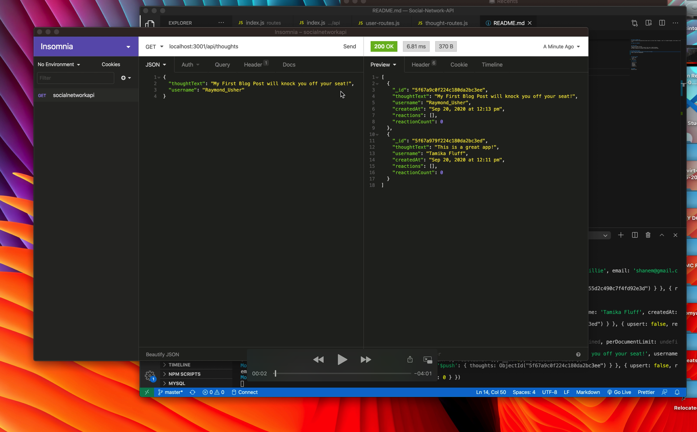

## SOCIAL NETWORK API
A social network web application where users can share their thoughts, react to friends’ thoughts, and create a friend list.

## TABLE OF CONTENTS

## USER STORY
AS A social media startup
I WANT an API for my social network that uses a NoSQL database
SO THAT my website can handle large amounts of unstructured data

## Video Walkthrough

Click to watch the video

# PART 1

# PART 2

## INSTALLATION 
* Clone repo
* npm i
* npm start

## LANGUAGES

* Vanilla JS
* Node.js
* MongoDB
* Mongoose
* Express.js

## AUTHOR
Rochelle Ruiz